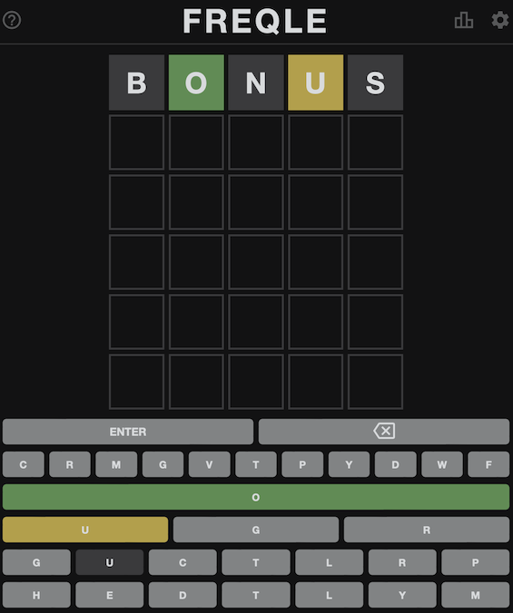
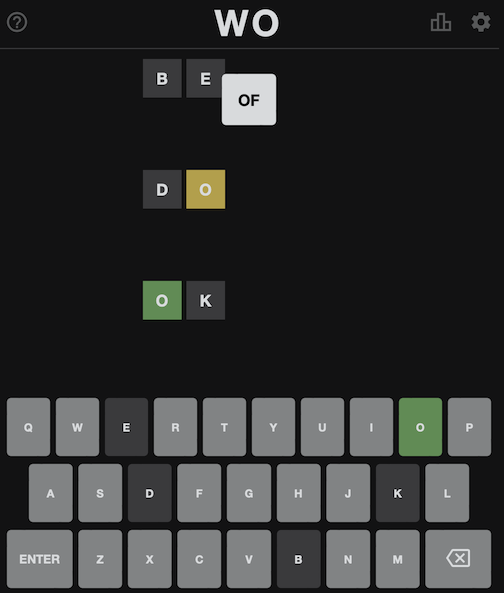

Two games based on the Wordle app at https://www.powerlanguage.co.uk/wordle/.

# Freqle

Replaces the keyboard with five rows of letters. The letters in a row (first row, second row, etc)
are ordered according to the frequencies of that letter (first letter, second letter, etc) in
the solution set.

The game filters the letter frequencies according to the player's hints. For instance, it
eliminates words not matched by 🟩 and ⬛ guesses.

Freqle doesn't help much with the first couple of guesses, but it typically narrows down the word
list enough to be considered cheating.

# Wo

The same rules as Wordle, but with three guesses for a two-letter word.

It's effectively impossible to win at Wo.
